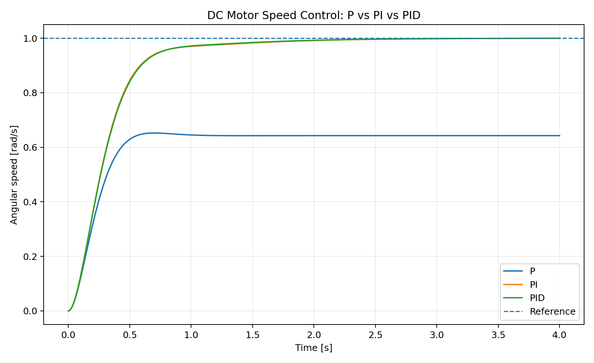

# DC Motor PID Control Simulation

A compact control-systems project that models an armature-controlled DC motor and compares **P, PI, and PID speed controllers** using numerical simulation in Python.



## What this project demonstrates

- DC motor electrical and mechanical modeling
- State-space style numerical simulation
- Fourth-order Runge-Kutta integration
- P, PI, and PID feedback control
- Actuator saturation and anti-windup logic
- Step-response performance metrics
- Automated testing and GitHub Actions CI

## Motor model

The electrical dynamics are

`V = L di/dt + R i + Ke omega`

and the mechanical dynamics are

`J domega/dt + b omega = Kt i - load_torque`.

See [`docs/MATHEMATICS.md`](docs/MATHEMATICS.md) for the derivation and notation.

## Repository structure

```text
src/dc_motor_control/   reusable motor, controller, simulation and metrics code
examples/               runnable engineering demonstrations
tests/                  automated tests
docs/                   model equations and implementation notes
assets/                 generated figures
.github/workflows/      continuous integration
```

## Run it

```bash
python -m venv .venv
# Windows: .venv\Scripts\activate
# Linux/macOS: source .venv/bin/activate
pip install -e . pytest
python examples/compare_controllers.py
pytest -q
```

## Current release: v0.1

- DC motor model
- open-loop and closed-loop simulation
- P/PI/PID controllers
- response metrics: rise time, overshoot, settling time and steady-state error
- controller comparison plot
- tests and cross-platform CI

## Planned extensions

- automatic PID tuning experiments
- load-disturbance rejection
- state-space model and pole placement
- LQR controller
- state observer / Kalman filtering
- comparison against measured motor data
